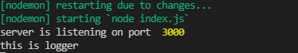
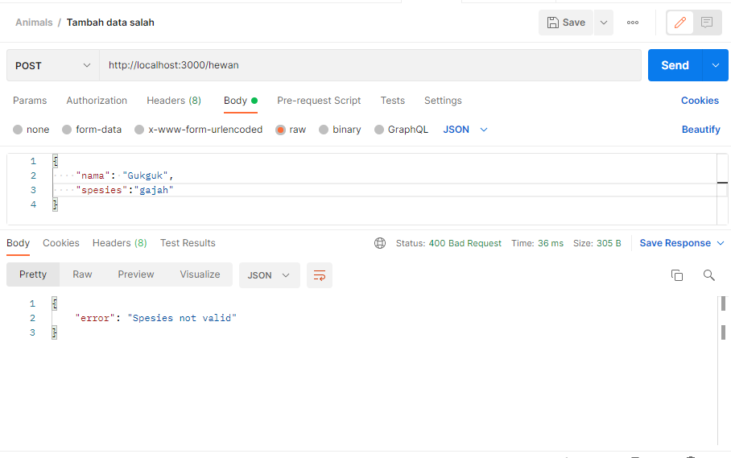

# Technichal-Assigngment-Express-Routing-and-Middleware

# No1
----
# Get all Hewan

-----
# Get hewan by id

----
# Tambah data hewan

----
# Ubah data hewan

----
# Delete data hewan

----

# No2
----
# Menambahkan logger

----
# Menambah data spesies salah

----